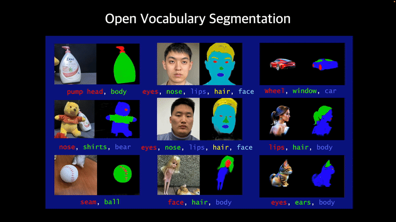
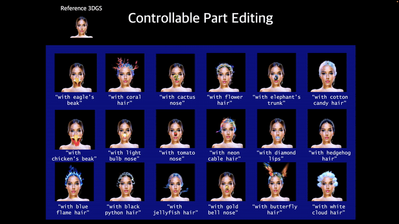

# RoMaP: Robust 3D-Masked Part-level Editing in 3D Gaussian Splatting with Regularized Score Distillation Sampling

[ICCV 2025 Paper]
**Hayeon Kim\*, Ji Ha Jang\*, Se Young Chun†**
Seoul National University
\*Equal contribution, †Corresponding author

[📄 Paper (arXiv)](https://arxiv.org/abs/2507.11061) | [📽️ Project Page](https://janeyeon.github.io/romap/) | [🔁 BibTeX](#citation) | [🗄️ Dataset](https://drive.google.com/drive/folders/1V3fHMUGB5y06pa1tnqnOEHGly-P7kjJa?usp=sharing)

## Overview

**RoMaP** is a novel framework for fine-grained **part-level editing of 3D Gaussian Splatting (3DGS)**, enabling edit instructions like:

> *"Turn his left eye blue and his right eye green"*
> *"Replace the nose with a croissant"*
> *"Give the hair a flame-texture style"*

Unlike existing baselines which struggle with local edits due to inconsistent 2D segmentations and weak SDS guidance, **RoMaP** combines:

- ✅ Geometry-aware segmentation `(3D-GALP)`
- ✅ Gaussian prior removal and local masking
- ✅ Regularized SDS with `SLaMP` (Scheduled Latent Mixing and Part Editing) image supervision

## Visual Results 

### Example 1: Open Vocabulary Part Segmentation


### Example 2: Controllable Part Editing



## Key Features

- **3D-GALP**: Robust 3D segmentation based on spherical harmonics-aware label prediction 
- **SLaMP editing**: Generates realistic part-edited 2D views to direct SDS in target-driven directions (Coming soon)
- **Regularized SDS Loss**: Anchored L1 + mask support + strong target control (Coming soon)


## Installation

Ensure your CUDA version ≥ 11.8 and PyTorch ≥ 2.1.0 is installed.

```bash
git clone https://github.com/janeyeon/RoMaP.git
cd RoMaP

conda create -n romap python=3.9
conda activate romap

pip install torch==2.1.0 torchvision==0.16.0 torchaudio==2.1.0 --index-url https://download.pytorch.org/whl/cu118

pip install ninja -U
pip install -r requirements.txt

cd gaussiansplatting/submodules/diff_gaussian_rasterization
pip install -e .
cd ../ 
git clone  https://github.com/camenduru/simple-knn.git
cd simple-knn
pip install -e .
cd ../../../lgm/diff_gaussian_rasterization_lgm
pip install -e .
cd ../../
# pytorch3d 
pip install "git+https://github.com/facebookresearch/pytorch3d.git@stable"

# tiny-cuda-nn (Torch bindings)
pip install git+https://github.com/NVlabs/tiny-cuda-nn/#subdirectory=bindings/torch

# nvdiffrast
pip install git+https://github.com/NVlabs/nvdiffrast

# nerfacc (by nerfstudio)
pip install git+https://github.com/nerfstudio-project/nerfacc

# PyTorch Lightning
conda install pytorch-lightning -c conda-forge

# libigl Python bindings
conda install -c conda-forge pyigl

pip install rembg onnxruntime einops trimesh wandb segmentation_refinement tyro roma  xformers==0.0.23 imageio[ffmpeg] imageio[pyav] plyfile lightning sentencepiece

```
### Download Dataset
You can download the datasets from this [link](https://drive.google.com/drive/folders/1V3fHMUGB5y06pa1tnqnOEHGly-P7kjJa?usp=sharing). This project utilizes the [NeRF-Art dataset](https://github.com/cassiePython/NeRF-Art), the [3D-OVS dataset](https://github.com/Kunhao-Liu/3D-OVS?tab=readme-ov-file), as well as a custom 3D Gaussian Splatting dataset created by us.

### For Reconstruction Scene Segmentation

```bash
sh run_recon_nerfart_yanan_seg.sh
```

- `prompt`: The main prompt for segmentation or editing, describing the target object.
- `seg_list`: A list of words specifying the parts you want to segment; it is recommended to list smaller (more specific) regions first, then larger ones. For compound words, you can include multiple terms in parentheses (e.g., `['sharp','eyes']`).
- `if_segment`: Set to `True` if you want segmentation to be performed on the scene.
- `ply_path`: A path or list of paths to pretrained PLY files you wish to use for initialization or further processing.
- `seg_softmax_list`: For fine-grained control, adjust softmax values here. In most cases, values between 0.1 and 0.2 yield good results. For segmenting larger regions, consider increasing this value.
- `if_recon`: Set to `True` if you are working with a reconstruction scene.
- `rot_name`: If you wish to apply a custom camera matrix transformation outside of the default `transformation.json`, add a new entry in `rotation_dict` within `threestudio/data/multiview.py` and specify its name here. If not specified, the default is used.
- `fov`: Use this to explicitly set the camera's field of view if you want to override the default setting.

### For Generation Scene Segmentation

```bash
sh run_gen_woman_seg.sh
```

- `if_gen`: Set to `True` if the scene is a generation scene.

### For Complex Scene Segmentation (3D-OVS Dataset)

```bash
sh run_recon_3d_ovs_bench_seg.sh
```
- `dataroot`: The folder path containing the desired point cloud and the corresponding `transforms.json`.
- `eval_interpolation`: For custom camera matrix control, specify a list where the first n-1 numbers indicate the camera matrix views you want to interpolate, and the last number defines into how many intervals each view pair should be divided.

## Experimental Results

| Method | CLIP↑ | CLIPdir↑ | B-VQA↑ | TIFA↑ |
| :-- | :-- | :-- | :-- | :-- |
| GaussCtrl | 0.182 | 0.044 | 0.190 | 0.432 |
| GaussianEditor | 0.179 | 0.087 | 0.370 | 0.571 |
| DGE | 0.201 | 0.095 | 0.497 | 0.565 |
| **RoMaP (Ours)** | **0.277** | **0.205** | **0.723** | **0.674** |

RoMaP consistently outperforms previous methods across all editing metrics, especially in:

- Part-level segmentation accuracy
- Drastic edit capacity (e.g., 'croissant nose', 'jellyfish hair')
- Identity-preserving edits with complex structures


## Citation

```bibtex
@inproceedings{kim2025romap,
  title={Robust 3D-Masked Part-level Editing in 3D Gaussian Splatting with Regularized Score Distillation Sampling},
  author={Hayeon Kim, Ji Ha Jang, Se Young Chun},
  booktitle={International Conference on Computer Vision (ICCV)},
  year={2025}
}
```

[^1]: 2507.11061v1.pdf


We would like to express our gratitude to the developers of [threestudio](https://github.com/threestudio-project/threestudio) and [Rectified flow prior](https://github.com/yangxiaofeng/rectified_flow_prior), as our code is primarily based on these repositories.